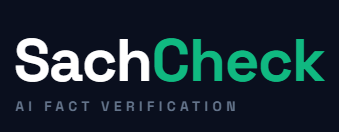

<p align="center">
  
</p>

<p align="center">
  An AI-powered claim-level fact verification for articles, news, and images, built to fight misinformation in real time.
</p>

<p align="center">
  
  
  
  
  
  
</p>


---

## How it works

Paste an article URL or text. Claude Haiku breaks it into atomic, verifiable claims. Each claim is cross-referenced in parallel against Google Fact Check, Wikipedia, GDELT, and ClaimBuster. A DeBERTa NLI model scores every evidence passage for entailment or contradiction, then Claude Sonnet synthesises a per-claim verdict with confidence and cited reasoning. Results stream to the browser via SSE as they arrive.

For images (screenshots, WhatsApp forwards, viral posters), Tesseract OCR extracts the text first, falling back to Claude Vision when confidence is low. The same evidence and synthesis pipeline then runs on the extracted claims, alongside nine manipulation signal detectors that flag urgency language, fake authority claims, missing attribution, and similar patterns.

---

## Features

- Claim-level granularity - verdicts per statement, not per domain
- 4-band verdict system: Supported · Refuted · Mixed · Insufficient Evidence
- NLI contradiction detection using DeBERTa-v3 across all evidence passages
- Web search fallback for claims too fresh or niche for structured sources
- Image fact-checking: OCR → claim extraction → evidence → verdict
- Real-time streaming via Server-Sent Events - no polling
- Every verdict cites the passages it reasoned from
- ~$0.006 per article check on the standard path

---

## Tech Stack

| Layer | Technology |
|---|---|
| Backend | Python 3.12, FastAPI, Pydantic v2, httpx |
| AI Models | Claude Haiku 4.5 (extraction), Claude Sonnet 4.6 (synthesis), Claude Vision (OCR fallback) |
| NLI | DeBERTa-v3-base-mnli-fever-anli (HuggingFace Transformers) |
| Evidence Sources | Google Fact Check API, Wikipedia, GDELT, ClaimBuster |
| OCR | Tesseract (primary), Claude Vision (fallback) |
| Streaming | Server-Sent Events (sse-starlette) |
| Frontend | Vite, React 18, TypeScript, Tailwind CSS v3, Framer Motion |

---

## Getting Started

### Prerequisites

- Python 3.12+
- Node.js 20+
- An [Anthropic API key](https://console.anthropic.com/)
- Tesseract OCR binary (optional - falls back to Claude Vision if absent)

```bash
# Ubuntu / Debian / WSL
sudo apt-get install -y tesseract-ocr

# macOS
brew install tesseract

# Windows - installer at https://github.com/UB-Mannheim/tesseract/wiki
```

### Installation

**Backend**

```bash
cd backend
python -m venv .venv
source .venv/bin/activate        # Windows: .venv\Scripts\Activate.ps1
pip install -r requirements.txt
cp .env.example .env             # then edit .env
uvicorn main:app --host 127.0.0.1 --port 8000 --reload
```

**Frontend**

```bash
cd frontend
npm install
# create frontend/.env with: VITE_API_URL=http://127.0.0.1:8000
npm run dev
```

Open [http://localhost:5173](http://localhost:5173).

### Environment Variables

| Variable | Required | Description |
|---|---|---|
| `ANTHROPIC_API_KEY` | ✅ | Anthropic API key |
| `ANTHROPIC_EXTRACT_MODEL` | no | Defaults to `claude-haiku-4-5-20251001` |
| `ANTHROPIC_SYNTHESIS_MODEL` | no | Defaults to `claude-sonnet-4-6` |
| `GOOGLE_FC_API_KEY` | no | Enables Google Fact Check source |
| `CLAIMBUSTER_API_KEY` | no | Enables ClaimBuster source |
| `NLI_ENABLED` | no | Set to `false` to disable DeBERTa (faster, less accurate) |
| `FRONTEND_ORIGIN` | no | CORS origin, defaults to `http://localhost:5173` |

---

## API Reference

### Article pipeline

**`POST /check`**
```json
{ "input": "https://example.com/article  OR  pasted article text" }
```
Returns `{ "check_id": "<uuid>" }`

**`GET /check/{check_id}/stream`** - SSE

| Event | Payload |
|---|---|
| `claim_extracted` | `{ id, text, entities }` |
| `nli_scored` | `{ claim_id, supporting, contradicting, verdict_band }` |
| `source_results` | `{ source_health }` |
| `web_search_triggered` | `{ reason }` |
| `web_search_complete` | `{ results_count, sources }` |
| `verdict` | `{ article_verdict, disclaimer }` |
| `done` | `{ status }` |
| `error` | `{ message }` |

### Image pipeline

**`POST /image-check`** - multipart, field `file`, max 10 MB  
Returns `{ "check_id": "<uuid>" }`

**`GET /image-check/{check_id}/stream`** - SSE

| Event | Payload |
|---|---|
| `ocr_complete` | `{ text, confidence, language, method }` |
| `claim_found` | `{ claim: { id, text } }` |
| `signals_ready` | `{ signals, signal_score }` |
| `verdict` | `{ verdict_label, band, confidence, reasoning, manipulation_signals }` |
| `done` | `{ status }` |
| `error` | `{ message }` |

---

## Contributing

Open an issue before submitting a PR. Bug fixes and well-scoped features are welcome.

---

## License

[MIT](LICENSE)
